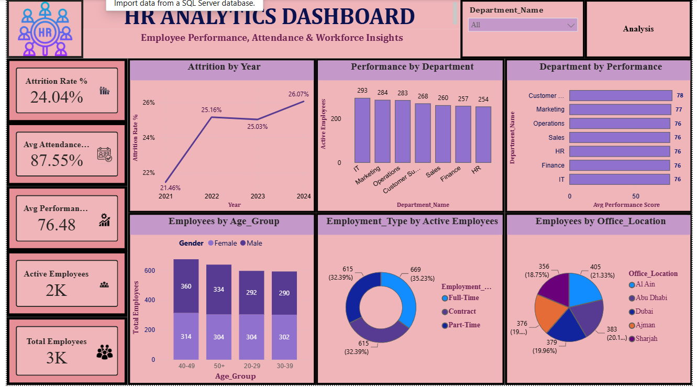
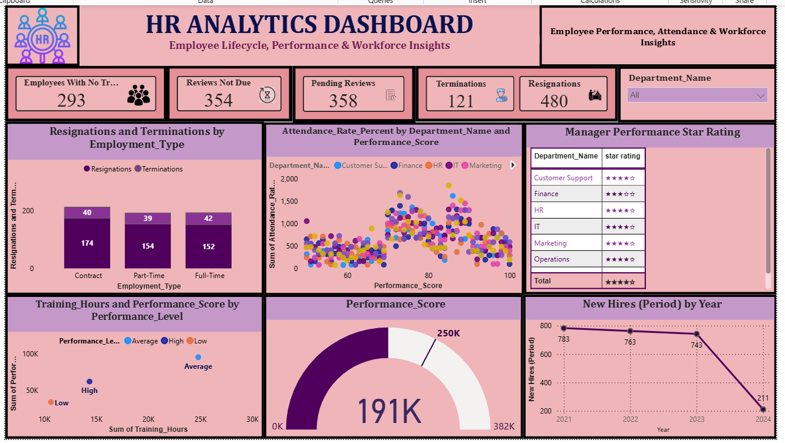

#  HR Analytics Dashboard | Power BI

## 📌 Project Overview

The **HR Analytics Dashboard** is an interactive Power BI project designed to analyze employee performance, attendance, attrition, workforce structure, training, hiring, and employee lifecycle trends.

The dashboard provides HR teams with a clear view of workforce-related metrics and helps identify areas that may require attention, such as increasing attrition, declining new hires, employee training needs, and workforce changes.

---

## 🎯 Project Objective

The main objective of this project is to transform HR data into meaningful and actionable insights using Power BI.

This dashboard helps answer important HR questions such as:

- What is the current employee attrition rate?
- How is attrition changing over time?
- Which departments have the highest number of active employees?
- How does employee performance vary across departments?
- What is the average employee attendance?
- How many employees have pending or upcoming performance reviews?
- How many employees have resigned or been terminated?
- How are employees distributed by employment type?
- How are employees distributed across office locations?
- How are training hours related to employee performance?
- How has hiring changed over the years?

---

## 🛠️ Tools & Technologies

- **Power BI**
- **Power Query** – Data cleaning and transformation
- **DAX** – Measures and KPI calculations
- **Microsoft Excel** – Data source
- **Data Visualization**
- **HR Analytics**

---

# 📈 Dashboard Pages

## 1️⃣ Workforce & Performance Overview

The first dashboard page provides a high-level overview of the organization's workforce, performance, attendance, attrition, age groups, employment types, and office locations.

### Key KPIs

| KPI | Value |
|---|---:|
| Attrition Rate | **24.04%** |
| Average Attendance | **87.55%** |
| Average Performance Score | **76.48** |
| Active Employees | **2K** |
| Total Employees | **3K** |

### Visualizations Included

- Attrition Rate by Year
- Active Employees by Department
- Average Performance by Department
- Employees by Age Group and Gender
- Employment Type Distribution
- Employees by Office Location
- Department Filter/Slicer

### Key Observations

- The overall **attrition rate is 24.04%**, showing that employee retention is an important area for HR to monitor.
- Attrition increased from **21.46% in 2021 to 26.07% in 2024**.
- Average employee attendance is **87.55%**.
- The average performance score is **76.48**.
- Around **2K employees are currently active** compared with approximately **3K total employees**.
- IT has the highest number of active employees among the departments shown.
- Employees are distributed across different age groups, genders, employment types, and office locations.

---

# 2️⃣ Employee Lifecycle & Performance Analysis

The second dashboard page focuses on employee lifecycle activities, including resignations, terminations, performance reviews, training, manager ratings, attendance, and new hiring.

### Key KPIs

| KPI | Value |
|---|---:|
| Employees with No Training | **293** |
| Reviews Not Due | **354** |
| Pending Reviews | **358** |
| Terminations | **121** |
| Resignations | **480** |

### Visualizations Included

- Resignations and Terminations by Employment Type
- Attendance Rate vs Performance Score
- Manager Performance Star Rating
- Training Hours vs Performance Level
- Overall Performance Score
- New Hires by Year
- Department Filter/Slicer

### Key Observations

- **480 resignations** are higher than the **121 terminations**, indicating that voluntary employee turnover is a major area to monitor.
- Contract employees have the highest number of resignations and terminations among the employment types shown.
- **293 employees have no recorded training**, which may indicate an opportunity to improve employee development programs.
- **358 performance reviews are pending**, suggesting that HR managers should prioritize completing these reviews.
- New hires declined significantly from **783 in 2021 to 211 in 2024**.
- Training and performance analysis can help HR identify opportunities for employee development.
- Manager performance ratings provide an additional view of departmental performance.

---

# 📊 Key Business Insights

### 1. Increasing Employee Attrition

The attrition rate increased from **21.46% in 2021 to 26.07% in 2024**.

**Recommendation:**  
HR should investigate the main reasons for employee turnover and introduce targeted retention strategies.

### 2. Significant Decline in New Hiring

New hires decreased from **783 in 2021 to 211 in 2024**.

**Recommendation:**  
Review hiring plans and ensure critical departments have enough employees to support business requirements.

### 3. Resignations Are Higher Than Terminations

The dashboard shows **480 resignations compared with 121 terminations**.

**Recommendation:**  
Analyze exit interview feedback, employee satisfaction, compensation, workload, and career growth opportunities to understand why employees are leaving.

### 4. Employee Training Opportunity

There are **293 employees with no recorded training**.

**Recommendation:**  
Provide suitable training and development programs, especially for employees who need improvement in performance.

### 5. Pending Performance Reviews

There are **358 pending performance reviews**.

**Recommendation:**  
HR and managers should complete pending reviews on time so employees receive timely feedback and development plans.

---

# 📌 Business Recommendations

Based on the dashboard analysis, the following actions can help HR improve workforce management:

- Develop employee retention strategies to reduce attrition.
- Investigate the reasons behind the increase in resignations.
- Review the significant decline in new hiring.
- Increase training opportunities for employees with limited training.
- Complete pending employee performance reviews.
- Monitor attendance and performance together to identify workforce patterns.
- Review department-level performance regularly.
- Use employee feedback and exit interview data to improve employee satisfaction.
- Strengthen workforce planning for critical departments.

---

# 📷 Dashboard Preview

## Workforce & Performance Overview



## Employee Lifecycle & Performance



---

# 📁 Project Structure

```text
HR-Analytics-Dashboard/
│
├── README.md
│
├── Dataset/
│   └── HR_Dataset.xlsx
│
├── PowerBI/
│   └── HR_Analytics_Dashboard.pbix
│
└── Screenshots/
    ├── HR_Dashboard_Overview.png
    └── HR_Dashboard_Lifecycle.png
